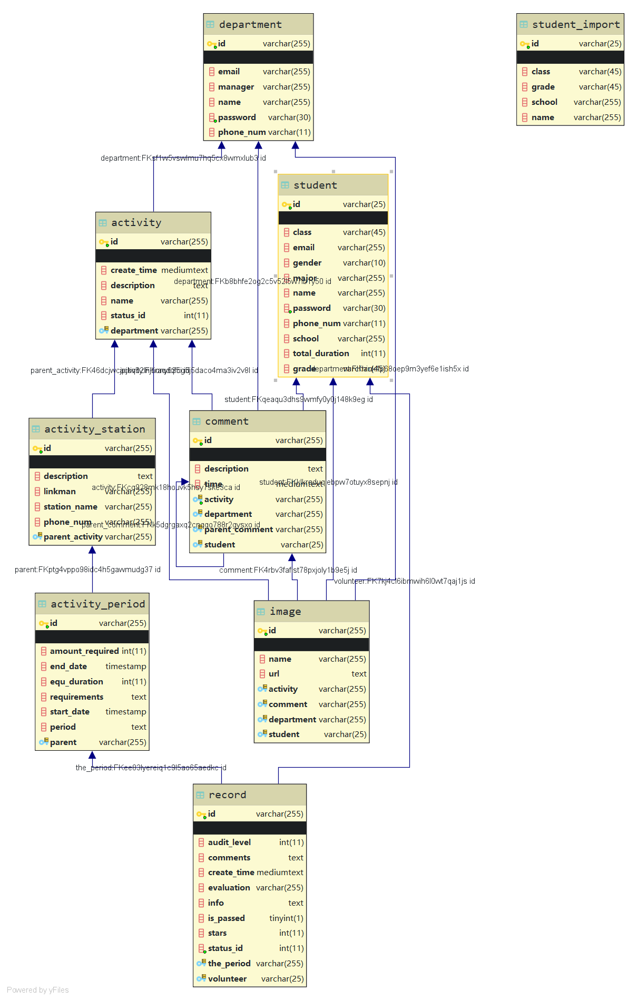

# 华北电力大学志愿活动系统
## 软件概要设计
本软件使用前后端分离的设计模式。不使用jsp，使用html网页中的js脚本进行前后端通信。
    
    在前后端分离模式下，如何解决模型与页面的绑定问题？
    后台除了主页以外，不再负责控制页面的跳转与返回。页面的跳转皆有前端js完成。

本软件使用maven管理依赖，tomcat作为web服务器。

软件后台架构为 spring boot + spring data jpa + spring mvc。

后台采用经典的分层结构，依次分为视图控制器controller，控制器操作的对象vo，
持久实体类entity，数据库访问层repository，业务逻辑层service。

## 软件详细设计
### 实体类设计

#### 志愿活动

志愿活动生命周期：
<ul>
<li>CONFIRMING 部门已发送等待审核</li>
<li>SEND 审核并修改</li>
<li>APPLY 报名</li>
<li>STARTED 录用并开始活动</li>
<li>FINISHED 结束并评价</li>
</ul>
共5个阶段。

志愿活动的报名十分复杂，结合具体案例分析，例如，在2019级迎新活动中，有多个
岗位，同一个岗位也可以分为不同地点，与时段。最终学生按照单一时间段报名。

因此，设计Activity类中包含多个ActivityStation，即一场志愿活动中有多个岗位；
设计ActivityStation中有多个ActivityPeriod，即一个岗位中分多个时间段，最终按
时间段报名。

#### 学生与志愿活动的关系

多个学生参加多个志愿活动，这是多对多关系，而且这个多对多关系是多层的，蕴含了
例如志愿报名结果，志愿成绩等信息。学生参加志愿活动分为如下流程：

<ul>
     <li>APPLIED 已报名</li>
     <li>PASSED 已审核</li>
     <li>EVALUATED 已评价</li>
</ul>

因此新建一个关联表Record即志愿记录类来解决这个问题。

#### 多级评论

允许添加评论的评论，因此评论是一个树状结构，只用如下方法处理树状结构的储存问题。

```
    /**
     * 父级评论，没有父级则为空
     */
    @ManyToOne(targetEntity = Comment.class)
    @JoinColumn(name = "parent_comment", referencedColumnName = "id")
    private Comment parentComment;

    @OneToMany(targetEntity = Comment.class, mappedBy = "parentComment")
    private List<Comment> sonComment;
```

#### 图片实体类的多用性 

Image实体类用于储存图片，可以是Student或Department的头像，也可以是评论与
活动介绍所带内容。该类与多个实体类保持多对一关系，减小了多个图片表造成的冗余。

#### 数据表结构



### 业务逻辑设计
#### 登录 

设计UserVo类，用于接收用户填写信息。在业务逻辑中自动判断用户身份，跳转向不同主页。

#### 账户信息修改

由于密码修改的特殊逻辑，这里不修改密码，只修改其他信息。
 
#### 密码修改

在点击*找回密码邮件*中的超链接之后，或者在*修改密码页面*输入原来密码之后，
就可以直接修改密码。

找回密码邮件中的超链接应包含加密的用户信息，在跳转之后进行解码判断是什么用户， 
从而修改密码。
#### 添加志愿活动

志愿活动的一次性添加

志愿活动按照ActivityPeriod进行报名，但增删改均以Activity为大类。而志愿活动的
查询既可以通过关联查询获得。

志愿活动的修改与删除

### web作用域限定
#### session作用域

UserId 学生或部门的id
UserCategory "Student" "Department" "Admin"

#### applicationContext作用域

path 服务器地址

### 前后端通信设计

#### 登录
http://192.168.43.1:8888/volunteer/login

发送 post application/json 

    id 用户名
    password 密码
    示例：{"id":"12345","password":"12345"}
返回 UserInfo转成的json

前端应根据其中的userCategory属性跳转至合适的页面：-1-登录失败 0-管理员 1-学生 2-部门
```
    {
        "userCategory":1,
        "student":{"studentNum":"120171020201",
        ... 学生其他信息
        },"department":null
    }
```

#### 登出
http://192.168.43.1:8888/volunteer/logout

发送
    
    无
返回

    主页 index.html

#### 修改学生信息
http://192.168.43.1:8888/volunteer/updateStudent

发送post application/json

    name 姓名
    phoneNum 电话号码
    email 邮箱
    profiles json数组，图片对象，包含name,url两个属性
    示例：{"email":"12345","name":"12","phoneNum":"1234","profiles":[{"name":"1234","url":"123456"}]}

注意，对于新的图片，要通过图片上传接口上传并得到图片的url，再加入profiles的
json数组中；若未上传新的图片，则保持原信息不变即可。

返回 json

    成功{"updateResult":"success"}
    失败{"updateResult":"failed"}
    
#### 修改部门信息
http://192.168.43.1:8888/volunteer/updateDepartment

发送post application/json

    phoneNum 
    manager
    email
    profiles 与上个接口相同
    
#### 图片上传
http://192.168.43.1:8888/volunteer/uploadImage

发送 post multipart/form-data

    file 文件本身

返回 json

    {uploadImage:success,url:图片的url}
    {uploadImage:error}

#### 修改密码
http://192.168.43.1:8888/volunteer/changePassword

发送 post application/x-www-form-urlencoded

    oldPassword 老密码
    password 新密码

返回 json

    {changePassword:success}
    {changePassword:error}

#### 发送验证邮件
http://192.168.43.1:8888/volunteer/sendEmail

发送 post application/x-www-form-urlencoded

    id 用户id
    
返回 json

    {sendEmail:success}
    {sendEmail:error}

### 前端页面设计
#### 主页
index.html
#### 学生主页
studentIndex.html 

学生信息修改子页面
#### 部门主页
departmentIndex.html

部门信息修改子页面
#### 修改密码页面
changePassword.html
#### 邮件验证错误页面
verifyFailed.html
## 软件调试

### jpa uuid主键生成策略
### 数据库长文本存储，mysql引擎
### spring service层分开实现的方法
类适配器模式与对象适配器模式

抽象类的注入与实现 https://blog.csdn.net/evilcry2012/article/details/78927479

一个接口或抽象类是难以分开成多个方法分别实现的，将其分成多个接口
并继承同一个接口也不行。

### RequestBody注解与ResponseBody注解

如果返回的不是页面，要添加ResponseBody注解。

对于RequestBody注解：
application/x-www-form-urlencoded，可选；
multipart/form-data, 不能处理（即使用@RequestBody不能处理这种格式的数据）；
其他格式，必须（其他格式包括application/json, application/xml等。
这些格式的数据，必须使用@RequestBody来处理）；

### 数据库主从同步与复制
https://www.cnblogs.com/hustcat/archive/2009/12/19/1627525.html
https://www.cnblogs.com/kylinlin/p/5258719.html

主从同步使得数据可以从一个数据库服务器复制到其他服务器上，在复制数据时，
一个服务器充当主服务器（master），其余的服务器充当从服务器（slave）。
因为复制是异步进行的，所以从服务器不需要一直连接着主服务器，从服务器甚至
可以通过拨号断断续续地连接主服务器。通过配置文件，可以指定复制所有的数据库
，某个数据库，甚至是某个数据库上的某个表。

有很多种配置主从同步的方法，可以总结为如下的步骤：

1．在主服务器上，必须开启二进制日志机制和配置一个独立的ID

2．在每一个从服务器上，配置一个唯一的ID，创建一个用来专门复制主服务器数据的账号

3．在开始复制进程前，在主服务器上记录二进制文件的位置信息

4．如果在开始复制之前，数据库中已经有数据，就必须先创建一个数据快照（可以使用
mysqldump导出数据库，或者直接复制数据文件）

5．配置从服务器要连接的主服务器的IP地址和登陆授权，二进制日志文件名和位置