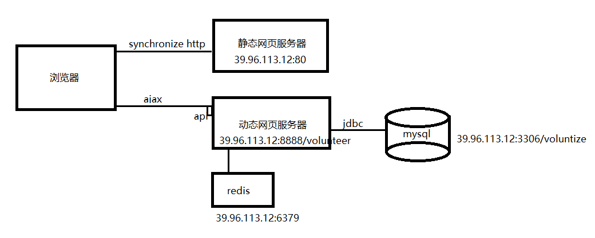

# Voluntize-华北电力大学公益劳动系统


## 简介
在去年学期末，我校教务处与我们签订劳动合同，开发公益劳动网站。
这样可以使每学期学生的公益劳动管理信息化，自动化。

## 软件概要设计
软件后台架构为 spring boot + spring data jpa/redis + spring mvc，内嵌tomcat服务器独立运行。
前端使用vue，运行于IIS服务器上。

本软件使用前后端半分离的设计模式。不使用jsp，使用前端js脚本进行页面渲染。

    传统java web开发步骤
    1前后端根据需求商议业务逻辑
    2后台设计好数据表，写好数据访问层和服务层。同时前端写好html页面
    3后台将前端的html页面套成jsp或thymeleaf
    4测试上线
    
    前后端分离开发步骤
    1前后端根据需求商议业务逻辑，拟定接口文档
    2前后端根据接口文档分别开发，使用json相互通信
    3前后端对接测试

这里是voluntize的后台spring boot软件，本软件使用maven管理依赖。

后台采用经典的分层结构，依次分为拦截器interceptor,视图控制器controller，控制器操作的对象vo，
持久实体类entity，数据库访问层repository，业务逻辑层service。



## 软件详细设计
### 实体类设计

#### 志愿活动

志愿活动生命周期：
<ul>
     <li>CONFIRMING 部门已发送等待审核</li>
     <li>SEND 开始报名</li>
     <li>STARTED 录用并开始活动</li>
     <li>FINISHED 正在评价</li>
     <li>NOT_PASS 没有通过</li>
     <li>DEAD 结束</li>
</ul>
共6个阶段。

志愿活动的报名十分复杂，结合具体案例分析，例如，在2019级迎新活动中，有多个
岗位，同一个岗位也可以分为不同地点，与时段。最终学生按照单一时间段报名。

因此，设计Activity类中包含多个ActivityStation，即一场志愿活动中有多个岗位；
设计ActivityStation中有多个ActivityPeriod，即一个岗位中分多个时间段，最终按
时间段报名。

#### 学生与志愿活动的关系

多个学生参加多个志愿活动，这是多对多关系，而且这个多对多关系是多层的，蕴含了
例如志愿报名结果，志愿成绩等信息。学生参加志愿活动分为如下流程：

<ul>
     <li>APPLIED 已报名</li>
     <li>PASSED 已审核</li>
     <li>EVALUATED 已评价</li>
     <li>COMMENTED 已反馈</li>
</ul>

因此新建一个关联表Record即志愿记录类来解决这个问题。

#### 多级评论

允许添加评论的评论，因此评论是一个树状结构，只用如下方法处理树状结构的储存问题。

```
    /**
     * 父级评论，没有父级则为空
     */
    @ManyToOne(targetEntity = Comment.class)
    @JoinColumn(name = "parent_comment", referencedColumnName = "id")
    private Comment parentComment;

    @OneToMany(targetEntity = Comment.class, mappedBy = "parentComment")
    private List<Comment> sonComment;
```

#### 图片实体类的多用性 

Image实体类用于储存图片，可以是Student或Department的头像，也可以是评论与
活动介绍所带内容。该类与多个实体类保持多对一关系，减小了多个图片表造成的冗余。

#### 数据表结构


### web作用域限定

#### cookies作用域

    JSESSIONID httpOnly=true path='/'
    Is-Visitor path='/'

#### session作用域 时间3600s

    UserId 学生或部门的id
    UserCategory "Student" "Department" "Admin"
    publicKey 公钥
    privateKey 私钥
    DesKey 用于邮件验证
    locked 会话锁
    simpleCaptcha 验证码
    codeTime 验证码有效时间
    UserAgentAndIP 用户浏览器和IP地址
    

#### applicationContext作用域

    path 服务器地址
    autoSendActivity 活动是否要经过管理员审核

### redis缓存
    
#### 序列化对象
只缓存Vo，不缓存相互依赖的实体类

    recordService缓存 RecordVoDpm RecordVoDpStu
    activityService缓存 ActivityResponseVo
    
#### DDos防刷 
可设置过期时间

    key 访问者ip 
    value 访问次数

## 前后端通信设计
### 拦截器

#### 无权限访问或者会话过期
    {
        "intercept":"2",//2学生或3部门或4管理员
        "message":"你的角色是...，没有访问学生接口的权限"
    }

#### 访问登录接口过于频繁
    {
        "intercept":"5",
        "message":"登录次数过于频繁，锁定会话，请填写验证码解锁会话"
    }
    {
        "intercept":"6",
        "message":"会话被锁定，请填写验证码解锁会话"
    }

#### 访问ip或浏览器突然改变
    {
        "intercept":"1",
        "message":"你的IP地址或浏览器种类刚刚发生了突变，但会话却没有变，为了防止黑客劫持会话，已将会话锁定。请填写验证码以解锁会话。"
    }
### 通用接口

#### 获取公钥
http://192.168.43.1:8888/volunteer/publicKey
rsa加密公钥

发送 get 无内容

返回 publickey

#### 登录，获取用户部分信息
http://192.168.43.1:8888/volunteer/login

发送 post application/json 

    id  //用户名
    password //密码
    encrypted //为false则密码不加密，否则要加密
    示例：{"id":"12345","password":"12345","encrypted":"false"}
    {"id":"12345","password":"cAWANkrwUbSoN2944FpPZPAOsK7B3Slzx6wID/JjzOzsAy+QVe3ab7RwyKLH9Dqo9ax61E...."}
    
返回 UserInfo转成的json

    示例：
    {
    "userCategory": 1,
    "student": {
        "studentNum": "002",
        "idNum": null,
        "gender": "男",
        "name": "测试2",
        "major": "核工程",
        "grade": null,
        "classs": null,
        "phoneNum": "18810380138",
        "email": "1003472560@qq.com",
        "school": null,
        "totalDuration": 44,
        "profiles": []
    },
    "department": null
    }

#### 登出
http://192.168.43.1:8888/volunteer/logout

发送
    
    无
返回

    主页 index.html

#### 图片上传
http://192.168.43.1:8888/volunteer/uploadImage

发送 post multipart/form-data

    file 文件本身

返回 json

    {uploadImage:success,url:图片的url}
    {uploadImage:error}

#### 修改密码
http://192.168.43.1:8888/volunteer/password/changePassword

发送 post application/x-www-form-urlencoded

    oldPassword 老密码
    password 新密码

返回 json

    {changePassword:success}
    {changePassword:error}

#### 发送验证邮件
http://192.168.43.1:8888/volunteer/password/sendEmail

发送 post application/x-www-form-urlencoded

    id 用户id

返回 json

    {sendEmail:success}
    {sendEmail:error}

#### 发表评论
http://192.168.43.1:8888/volunteer/comment/save

发送 post application/json

```
    private String id;//添加id时为修改，不添加为新增
    private String content;//评论内容
    private ArrayList<ImageVo> imageVos;//数组，若无则不写
    private String parentCommentId;//父评论id，若无则不写
    private String activityId;//不填则为首页通知
```
示例:
```
{
        "parentCommentId": null,
        "content": "老师很棒",
        "activityId": "001",
        "images": []
}
```
返回 json 包含保存评论的id
```
{
    "result": {
        "commentId": "2fc14154-4f8a-4ef3-902e-39b40ee29666",
        "save": "no parent comment found but result success"
    }
}
```
#### 删除评论
http://192.168.43.1:8888/volunteer/comment/delete

发送 post application/x-www-form-urlencoded
```
commentId 要删除的评论id
```

返回 无 

#### 获取首页通知
http://192.168.43.1:8888/volunteer/comment/getIndexComments

发送 post 无

返回 json 数组 首页通知

#### 获取特定活动的评论区（分页） [2020.2.6 修改]
http://192.168.43.1:8888/volunteer/comment/getComments

发送 post application/x-www-form-urlencoded
```
activity 该活动的id
page 页码
```

返回 json数组 每页10条
示例：activity = 001 size = 3 page = 0
```
[
    {
        "id": "3001",
        "time": "2019-03-13 20:30:13.0",
        "parentCommentId": null,
        "content": "老师很棒",
        "distributorCategory": "student",
        "distributorName": "邵博深",
        "distributorId": "120181080701",
        "activityId": "001",
        
    },
    {
        "id": "3002",
        "time": "2019-03-13 17:51:00.0",
        "parentCommentId": null,
        "content": "认真",
        "distributorCategory": "department",
        "distributorName": "图书馆（主）",
        "distributorId": "6177001",
        "activityId": "001",
    },
    {
        "id": "3004",
        "time": "2020-01-27 07:56:37.0",
        "parentCommentId": "3006",
        "content": "asdf",
        "distributorCategory": "student",
        "distributorName": "葛翰臣",
        "distributorId": "120171020201",
        "activityId": "001",
    
    }
]
```
#### 查询活动信息
http://192.168.43.1:8888/volunteer/query/activity

发送 post application/x-www-form-encoded

activityId或stationId或periodId

返回 查询的最外层activity的所有信息


### 部门接口
#### 修改部门信息
http://192.168.43.1:8888/volunteer/department/updateDepartment

发送post application/json

    phoneNum 
    manager
    email
    profiles //与上个接口相同

#### 获取已发送的活动信息
http://192.168.43.1:8888/volunteer/department/query/released

发送 post 无内容

返回 json
```
[
    {
        "id": "001",
        "name": "2019图书馆公益活动",
        "semester": "2019-2020第一学期",
        "description": "搬运书籍，贴标签等",
        "departmentId": "6177001",
        "departmentName": "图书馆（主）",
        "status": 0,
        "images": [],
        "stations": [
            {
                "id": "1001",
                "name": "主C 101",
                "linkman": "张三",
                "phoneNum": "61772591",
                "description": "adoifudnxiudsaoyfuiaofnyuadiof",
                "parentId": "001",
                "periods": [
                    {
                        "id": "1",
                        "parentStationId": "1001",
                        "parentStationName": "主C 101",
                        "parentActivityId": "001",
                        "parentActivityName": "2019图书馆公益活动",
                        "startDate": "2020-01-11 02:23:37.0",
                        "endDate": "2020-01-20 02:22:58.0",
                        "timePeriod": "上午8点开始，下午不用来",
                        "requirements": null,
                        "equDuration": 20,
                        "amountRequired": 20
                    },
                    {
                        "id": "2",
                        "parentStationId": "1001",
                        "parentStationName": "主C 101",
                        "parentActivityId": "001",
                        "parentActivityName": "2019图书馆公益活动",
                        "startDate": "2020-01-14 02:26:00.0",
                        "endDate": "2020-01-20 02:25:25.0",
                        "timePeriod": "下午2点开始，上午不用来",
                        "requirements": null,
                        "equDuration": 20,
                        "amountRequired": 10
                    }
                ]
            },
            {
                "id": "1002",
                "name": "图书馆主馆101",
                "linkman": "李四",
                "phoneNum": "61773253",
                "description": "任意内容",
                "parentId": "001",
                "periods": []
            },
            {
                "id": "1003",
                "name": "图书馆主馆305",
                "linkman": "王五",
                "phoneNum": "61773241",
                "description": "任意内容",
                "parentId": "001",
                "periods": []
            }
        ]
    },
    {
        "id": "003",
        "name": "2018图书馆公益活动",
        "semester": "2018-2019第二学期",
        "description": "为了增强学生实践精神，并减小学校各部门工作负担。。。",
        "departmentId": "6177001",
        "departmentName": "图书馆（主）",
        "status": 4,
        "images": [],
        "stations": []
    },
    {
        "id": "0779c44d-4034-47d0-93bf-2d49829ed7ed",
        "name": "2019图书馆公益活动4",
        "semester": "2019-2020第一学期",
        "description": "搬运书籍，贴标签等",
        "departmentId": "6177001",
        "departmentName": "图书馆（主）",
        "status": 0,
        "images": [],
        "stations": []
    },
    {
        "id": "6e1cd45a-0f16-4444-9f8b-3231f1cf5335",
        "name": "2019图书馆公益活动2",
        "semester": "2019-2020第一学期",
        "description": "搬运书籍，贴标签等",
        "departmentId": "6177001",
        "departmentName": "图书馆（主）",
        "status": 0,
        "images": [],
        "stations": []
    },
    {
        "id": "9c2a048a-4b07-48c9-bba4-ce3f1f6345ed",
        "name": "2019图书馆公益活动3",
        "semester": "2019-2020第一学期",
        "description": "搬运书籍，贴标签等",
        "departmentId": "6177001",
        "departmentName": "图书馆（主）",
        "status": 0,
        "images": [],
        "stations": []
    }
]
```

#### 获取特定活动时间段的报名记录
http://192.168.43.1:8888/volunteer/department/query/records

发送 post application/x-www-form-urlencoded

```
periodId 时间段
```

返回 json
```
[
    {
        "id": "02",
        "volunteerId": "120181080702",
        "periodId": "1",
        "info": "玩耍……",
        "status": 2,
        "auditLevel": 0,
        "evaluation": "被录取而一直未到",
        "stars": 0,
        "comment": null,
        "passed": true
    },
    {
        "id": "05",
        "volunteerId": "120181080704",
        "periodId": "1",
        "info": "试试吧",
        "status": 0,
        "auditLevel": null,
        "evaluation": null,
        "stars": 0,
        "comment": null,
        "passed": false
    },
    {
        "id": "06",
        "volunteerId": "120181080703",
        "periodId": "1",
        "info": "放心",
        "status": 0,
        "auditLevel": null,
        "evaluation": null,
        "stars": 0,
        "comment": null,
        "passed": false
    }
]
```

#### 获取特定学生信息 
http://192.168.43.1:8888/volunteer/department/query/studentInfo

发送 post application/x-www-form-urlencoded

```
studentId 学生学号
```

返回 json
```
{
    "studentNum": "120171020201",
    "idNum": "341003199908170034",
    "name": "葛翰臣",
    "major": "电气工程及其自动化",
    "grade": "大三",
    "classs": "电气1710",
    "phoneNum": null,
    "email": "Macswelle@outlook.com",
    "school": "电气学院",
    "totalDuration": 0,
    "profiles": [
        {
            "name": null,
            "url": "https://image.baidu.com/search/detail?ct=503316480&z=0&ipn=false&word=%E5%A4%B4%E5%83%8F&step_word=&hs=0&pn=42&spn=0&di=53570&pi=0&rn=1&tn=baiduimagedetail&is=0%2C0&istype=2&ie=utf-8&oe=utf-8&in=&cl=2&lm=-1&st=-1&cs=3117110987%2C173625746&os=2075175500%2C824963435&simid=0%2C0&adpicid=0&lpn=0&ln=3718&fr=&fmq=1579421350054_R&fm=result&ic=&s=undefined&hd=&latest=&copyright=&se=&sme=&tab=0&width=&height=&face=undefined&ist=&jit=&cg=head&bdtype=0&oriquery=&objurl=http%3A%2F%2Fimg2.woyaogexing.com%2F2018%2F03%2F10%2F9a68831f24d2985b!360x360_big.jpg&fromurl=ippr_z2C%24qAzdH3FAzdH3Fooo_z%26e3Bo5yw52jxtg2_z%26e3Bv54AzdH3Fp57xtwg2AzdH3FojtxtgAzdH3Fda8bAzdH3Fclmaac_z%26e3Bip4s&gsm=&rpstart=0&rpnum=0&islist=&querylist=&force=undefined"
        }
    ]
}
```


#### 新建活动
http://192.168.43.1:8888/volunteer/department/service/saveActivity

发送 post application/json

```
id //添加id时为修改，不添加为新增
name 
semester 
description
departmentId
images //json数组，图片对象，包含name,url两个属性
```
示例：
```
{
    "name": "2019图书馆公益活动4",
    "semester": "2019-2020第一学期",
    "description": "搬运书籍，贴标签等",
    "departmentId": "6177001",
    "images": []
}
```

返回  json 其中包含已保存活动的id信息

```
{"save activity": "0779c44d-4034-47d0-93bf-2d49829ed7ed"}
```


#### 为已有活动添加活动地点
http://192.168.43.1:8888/volunteer/department/service/saveStation

发送 post application/json

```
id//添加id时为修改，不添加为新增
name
linkman
phoneNum
description
parentId //活动的id
```

```
{
    "name": "主C 101",
    "linkman": "张三",
    "phoneNum": "61772591",
    "description": "",
    "parentId": "6177001"
}
```
返回  json 其中包含报存活动地点的id信息

#### 为已有活动地点添加时间段
http://192.168.43.1:8888/volunteer/department/service/savePeriod

发送 post application/json

```
id//添加id时为修改，不添加为新增
parentStationId//不能为空
startDate//起始日期，格式： 2020-01-11 02:23:37.0
endDate//结束日期
timePeriod//以字符串表示每天几点开始几点结束
requirements//需求
equDuration//等效时长
amountRequired//需要人数
```

示例：
```
{
    "startDate": "2020-01-11 02:23:37.0",
    "endDate": "2020-01-20 02:22:58.0",
    "timePeriod": "上午8点开始，下午不用来",
    "requirements": null,
    "equDuration": 20,
    "amountRequired": 20
}
```
返回  json 其中包含报存活动时间段的id信息

#### 删除活动，活动地点或活动时间段
http://192.168.43.1:8888/volunteer/department/service/cancel

发送 post application/x-www-form-urlencoded

下面三个属性三选一
```
activityId //要删除活动的id
stationId //要删除活动地点的id
periodId //要删除活动时间段的id

```

不返回内容

#### 批量审核报名
http://192.168.43.1:8888/volunteer/department/service/approve

发送 json数组
通过审核的报名记录（record）的id

不返回内容

#### 批量评价打分  
http://192.168.43.1:8888/volunteer/department/service/evaluate

发送 json数组
```
recordId//报名记录（record）的id
evaluate//评语
auditLevel//5个等级
```

实例：

```
    [
        {"recordId":"1234456","evaluate":"some words here...","auditLevel":5},
        {"recordId":"123qs464536","evaluate":"some words here...","auditLevel":1}
    ]
```

不返回内容
### 学生接口
#### 修改学生信息
http://192.168.43.1:8888/volunteer/student/updateStudent

发送post application/json

```
    name 姓名
    phoneNum 电话号码
    email 邮箱
    profiles json数组，图片对象，包含name,url两个属性
```

示例：
```
    {
        "email":"12345",
        "name":"12",
        "phoneNum":"1234",
        "profiles":[
                {"name":"1234","url":"123456"},
                {"name":"1234","url":"123456"}
            ]
    }
```

注意，对于新的图片，要通过图片上传接口上传并得到图片的url，再加入profiles的
json数组中；若未上传新的图片，则保持原信息不变即可。

返回 json

    成功{"updateResult":"success"}
    失败{"updateResult":"failed"}


#### 获取可报名的活动信息  [2020.2.6 修改]
http://192.168.43.1:8888/volunteer/student/query/findIndexActivities

发送 post 无信息

返回 json数组

示例：
```
[
    {
        “state”：0//当前状态，可供选择：0，已选择、取消选择：1
        "name": "2018图书馆公益活动",//活动名称
        "description": "打杂",//活动内容介绍
        "stations": [
            {
                "name": "图书馆主馆305",//劳动地点
                "periods": [
                    {
                       
                        "startDate": "2020-01-27 21:34:13",//开始时间
                        "endDate": "2020-02-27 21:34:13",//结束时间
                        "timePeriod": "每天中午12点-下午1点",//每日工作时间
                        "requirements": null,//录取要求
                        "equDuration": 15,//劳动时长
                        "amountRequired": 14,//所需人数
                        "amountSigned": 11//已报人数
                    }
                ]
            }
        ]
    }
    
    {
        “state”：1//当前状态，可供选择：0，已选择、取消选择：1
        "name": "财务处算账",//活动名称
        "description": "打杂",//活动内容介绍
        "stations": [
            {
                "name": "D305",//劳动地点
                "periods": [
                    {
                       
                        "startDate": "2020-01-27 21:34:13",//开始时间
                        "endDate": "2020-02-27 21:34:13",//结束时间
                        "timePeriod": "每周二下午2点到5点",//每日工作时间
                        "requirements": 诚实守信,//录取要求
                        "equDuration": 30,//劳动时长
                        "amountRequired": 5//所需人数
                        "amountSigned": 11//已报人数
                    }
                ]
            }
        ]
    }

    ……
]
```

#### 获取自己的公益劳动报名记录  [2020.2.6 修改]
http://192.168.43.1:8888/volunteer/student/query/getRecord

发送 post 
status 可取 0,1,2,3 也可以不带此参数


返回 json数组

示例：
```
[
    {
        “state”：0//当前状态，待审核：0，进行中：1，待部门评价：2
        "name": "2018图书馆公益活动",//活动名称
        "description": "打杂",//活动内容介绍
        "stations": [

            {
                "name": "图书馆主馆305",//劳动地点
                "linkman": "王五",//联系人
                "phoneNum": "61773241",//联系电话
                "periods": [
                    {
                       
                        "startDate": "2020-01-27 21:34:13",//开始时间
                        "endDate": "2020-02-27 21:34:13",//结束时间
                        "timePeriod": "每天中午12点-下午1点",//每日工作时间
                        "requirements": null,//录取要求
                        "equDuration": 15,//劳动时长
                        "amountRequired": 14,//所需人数
                        
                    }
                ]
            }
        ]
    }

    {
         “state”：2//当前状态，待审核：0，进行中：1，待部门评价：2
        "name": "财务处",//活动名称
        "description": "打杂",//活动内容介绍
        "stations": [

            {
                "name": "D305",//劳动地点
                "linkman": "湛山",//联系人
                "phoneNum": "61775241",//联系电话
                "periods": [
                    {
                       
                        "startDate": "2020-01-27 21:34:13",//开始时间
                        "endDate": "2020-02-27 21:34:13",//结束时间
                        "timePeriod": "每天中午12点-下午1点",//每日工作时间
                        "requirements": null,//录取要求
                        "equDuration": 15,//劳动时长
                        
                    }
                ]
            }
        ]
    }


    ……
]
```

#### 报名参加活动
http://192.168.43.1:8888/volunteer/student/service/participate

发送 post application/json 

```
    periodId //活动时间段的id
    info //报名备注信息
```

返回 json 成功或失败

#### 取消报名
http://192.168.43.1:8888/volunteer/student/service/cancel

发送 post application/a-www-form-urlencoded

```
    recordId 报名记录的id
```

返回 json 成功或失败

#### 活动结束后评价
http://192.168.43.1:8888/volunteer/student/service/appraise

发送 post application/json

```
    recordId
    comment//学生评价
    stars//评星1-5
```

返回 json 成功或失败

### 管理员接口

#### 创建或修改账号

http://192.168.43.1:8888/volunteer/admin/user/save

发送  post application/json
账户密码也在此修改，包含属性有：
```
    private String id;
    private Integer category;//1为学生，2为部门
    private String name;//学生名或部门名
    private String password;//若不提供，则初始密码为123456
    
    //学生的信息，更新部门信息时不需要发送这些属性
    private String classs;//班级，多加一个s避免与关键字冲突
    private String grade;
    private String major;
    private String gender;
    private String idNum;//身份证号
    private String school;//学生学院
    
    //部门的信息，更新学生时不要发送
    private String manager;//管理员
```

返回
```json
{
  "saveUser": "120171020201",
  "category": "student"
}
```
或者
```json
{
  "saveUser": "A student's id cannot be the same as a department's.",
  "category": "student"
}
```
```json
{
  "saveUser": "No such category."
}
```

#### 删除账号
http://192.168.43.1:8888/volunteer/admin/user/delete

发送  post application/x-www-form-urlencoded

    id  部门或者学生的账号
 
返回 json  
```json
{"deleteUser": "A student account deleted."}
```
```json
{"deleteUser":"No such user."}
```

#### 删除活动
http://192.168.43.1:8888/volunteer/admin/activity/delete

发送 post application/x-www-form-urlencoded

    id 所删除活动的id

返回 无内容

#### 保存活动
用于保存和修改活动信息，管理员拥有绝对权限
http://192.168.43.1:8888/volunteer/admin/activity/save

发送 post json
 
！要在查询活动的结果基础上做修改

```
 {
        "id": "001",
        "name": "2019图书馆公益活动",
        "semester": "2019-2020第一学期",
        "description": "搬运书籍，贴标签等",
        "departmentId": "6177001",
        "departmentName": "图书馆（主）",
        "status": 0,
        "images": [],
        "stations": [
            {
                "id": "1001",
                "name": "主C 101",
                "linkman": "张三",
                "phoneNum": "61772591",
                "description": "adoifudnxiudsaoyfuiaofnyuadiof",
                "parentId": "001",
                "periods": [
                    {
                        "id": "1",
                        "parentStationId": "1001",
                        "parentStationName": "主C 101",
                        "parentActivityId": "001",
                        "parentActivityName": "2019图书馆公益活动",
                        "startDate": "2020-01-11 02:23:37.0",
                        "endDate": "2020-01-20 02:22:58.0",
                        "timePeriod": "上午8点开始，下午不用来",
                        "requirements": null,
                        "equDuration": 20,
                        "amountRequired": 20
                    },
                    {
                        "id": "2",
                        "parentStationId": "1001",
                        "parentStationName": "主C 101",
                        "parentActivityId": "001",
                        "parentActivityName": "2019图书馆公益活动",
                        "startDate": "2020-01-14 02:26:00.0",
                        "endDate": "2020-01-20 02:25:25.0",
                        "timePeriod": "下午2点开始，上午不用来",
                        "requirements": null,
                        "equDuration": 20,
                        "amountRequired": 10
                    }
                ]
            },
            {
                "id": "1002",
                "name": "图书馆主馆101",
                "linkman": "李四",
                "phoneNum": "61773253",
                "description": "任意内容",
                "parentId": "001",
                "periods": []
            },
            {
                "id": "1003",
                "name": "图书馆主馆305",
                "linkman": "王五",
                "phoneNum": "61773241",
                "description": "任意内容",
                "parentId": "001",
                "periods": []
            }
        ]
    }
```

返回 json 

#### 获取待审核的活动
http://192.168.43.1:8888/volunteer/admin/activity/findConfirming

发送 post 无内容

返回 json数组 

格式与/student/query/findIndexActivities、/department/query/released等接口相同

#### 审批部门活动
http://192.168.43.1:8888/volunteer/admin/activity/confirm

发送 post application/x-www-form-urlencoded 不是批量操作的

    activityId 所审批活动的id

返回
```json
{"confirm": "success"}
```

#### 开启自动审核模式
http://192.168.43.1:8888/volunteer/admin/activity/autoSendActivity

发送 post application/x-www-form-urlencoded

    autoSendActivity true或false

返回
```json
{"AutoSendActivity enable": true}
```

#### 获取已审批的活动
http://192.168.43.1:8888/volunteer/admin/activity/findOthers

发送 post application/x-www-form-urlencoded

    page 页码（每页10个活动对象）

返回 json 分页查询

格式与/student/query/findIndexActivities、/department/query/released等接口相同

#### 查询信息
http://192.168.43.1:8888/volunteer/admin/excel/search

发送  post application/x-www-form-urlencoded

    id 学生或部门id

返回 json

```
    //前3个属性和login接口返回的一样
    private int userCategory;
    private StudentVo student;//学生基本信息
    private DepartmentVo department;//部门基本信息
    
    //如果是学生，返回他的活动记录
    private List<RecordVoStu> stuRecords = new ArrayList<>();
    //如果时部门，返回他发布的所有活动
    private List<ActivityVo> depActivities = new ArrayList<>();
```

#### 批量导出学生记录
http://192.168.43.1:8888/volunteer/admin/excel/stu

发送 post application/x-www-form-urlencoded

    grade  年级，只填数字，如“2017”，不填则导出全部

返回 multipart/form-data

文件 student_all.xlsx student_2017.xlsx
表格信息与学生登录接口返回信息一样

#### 其它没有写文档的接口

    /admin/activity/deConfirm，/admin/user/deleteStuByGrade，/admin/user/getWhatCanBeDeleted，/admin/user/reset，/admin/excel/dep，/admin/activity/records，
    /password/captcha，/password/verify，
    /getLoginVo,/publicKey,/unlock,
    /department/service/createActivity,/department/service/terminate,/department/service/start,/department/service/startEvaluation,/department/query/pages
    
## 软件调试

### jpa uuid主键生成策略
### 数据库长文本存储，mysql引擎
### spring service层分开实现的方法
类适配器模式与对象适配器模式

抽象类的注入与实现 https://blog.csdn.net/evilcry2012/article/details/78927479

一个接口或抽象类是难以分开成多个方法分别实现的，将其分成多个接口
并继承同一个接口也不行。

### RequestBody注解与ResponseBody注解

如果返回的不是页面，要添加ResponseBody注解。

对于RequestBody注解：
application/x-www-form-urlencoded，可选；
multipart/form-data, 不能处理（即使用@RequestBody不能处理这种格式的数据）；
其他格式，必须（其他格式包括application/json, application/xml等。
这些格式的数据，必须使用@RequestBody来处理）；

### 数据库主从同步与复制
https://www.cnblogs.com/hustcat/archive/2009/12/19/1627525.html
https://www.cnblogs.com/kylinlin/p/5258719.html

主从同步使得数据可以从一个数据库服务器复制到其他服务器上，在复制数据时，
一个服务器充当主服务器（master），其余的服务器充当从服务器（slave）。
因为复制是异步进行的，所以从服务器不需要一直连接着主服务器，从服务器甚至
可以通过拨号断断续续地连接主服务器。通过配置文件，可以指定复制所有的数据库
，某个数据库，甚至是某个数据库上的某个表。

有很多种配置主从同步的方法，可以总结为如下的步骤：

1．在主服务器上，必须开启二进制日志机制和配置一个独立的ID

2．在每一个从服务器上，配置一个唯一的ID，创建一个用来专门复制主服务器数据的账号

3．在开始复制进程前，在主服务器上记录二进制文件的位置信息

4．如果在开始复制之前，数据库中已经有数据，就必须先创建一个数据快照（可以使用
mysqldump导出数据库，或者直接复制数据文件）

5．配置从服务器要连接的主服务器的IP地址和登陆授权，二进制日志文件名和位置

### 加密问题

前端发来的加密信息是base64编码而不是Java默认的unicode编码，要先解码成byte[]

    Base64.getDecoder().decode()

### Page对象，Optional对象，实体类对象序列化与反序列化问题

Page对象要被序列化缓存在redis中，但在从redis取出时会无法反序列化，
因为Page对象没有空构造器。

https://stackoverflow.com/questions/52490399/spring-boot-page-deserialization-pageimpl-no-constructor?noredirect=1&lq=1

### 数据库密码加密
 F:\maven\repository\com\alibaba\druid\1.1.10> java -cp druid-1.1.10.jar com.alibaba.druid.filter.config.ConfigTools 123456

privateKey:MIIBVQIBADANBgkqhkiG9w0BAQEFAASCAT8wggE7AgEAAkEAnsU5HQBR8H7QhawjHu4rYOQ9mqCzdbN93+ChLRLsOZK9JZhhSw8Q7hyqw4LrK7Uisfjb1PVeyAQxh2rKEpA/CQIDAQABAkAa+6XDOgSy/LpvnVuyrAOPSfr2Ro15WXHxFHoP8QFYn0RqI819LkO4wKbhA43Hu2g6yesIrGE+85/QY62CFbUBAiEA6Rd9P+A8dJxOnsFO3wugIr/qWCne/sze4qJNjdCFznECIQCuX9VbxmXrdFGeMmoiY/8emik567uia9dT2/pkt0d2GQIhANpe7TJoi3rb7TQB+jgwFgg4L/4EzCt+F9nPIEUZ9CGhAiEAoqCaWmeksn3fiQ030y8zxpS8klp6uradMobc9oXAzjECIGTQ76BLr7U1aLWdzET+/VuIagfiflxpCPslFQDnd4oX

publicKey:MFwwDQYJKoZIhvcNAQEBBQADSwAwSAJBAJ7FOR0AUfB+0IWsIx7uK2DkPZqgs3Wzfd/goS0S7DmSvSWYYUsPEO4cqsOC6yu1IrH429T1XsgEMYdqyhKQPwkCAwEAAQ==

password:lW2Y36sHhSDFz5QtLsCT57Q/sU3uayv2mKL+DWgk/nwCR3YVJz2lrndolv8XHv0RupBLlumSpkYyEVC4v5pO6A==
